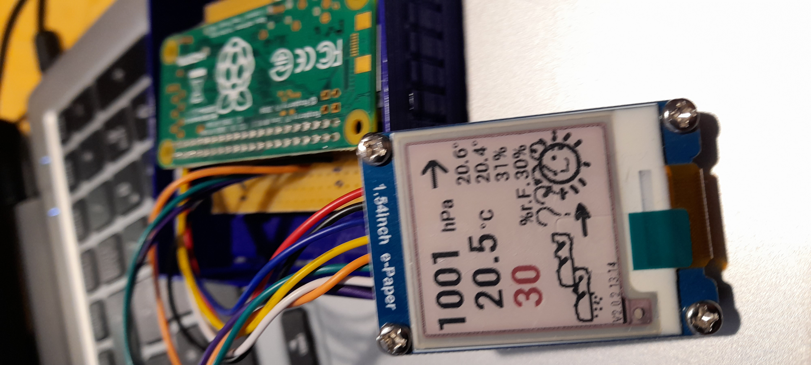
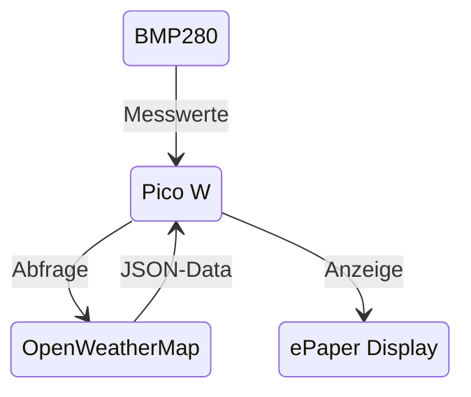

# Skizze: Anzeige von Wetterdaten 

## Ziel
- Abfrage von Wetter/Klimadaten
	-	Aussen: Temperatur, Feuchtigkeit, Wind, Luftdruck von OpenWeatherMap
	-	Innen: Temperatur, Druck, Feuchtigkeit von einem BME280-Sensor
- Aufbereitung auf einem Raspberry Pico W
- Ausgabe auf einem ePaper-Display

so könnte es aussehen:

## Datenfluss

## Beispiele
### 1. BME280-Sensor und Raspberry Pico
Ein (fremdes) Beispiel zur Anzeige von Temperatur, Feuchtigkeit, Druck mit BME280-Sensor und Raspberry Pico, Verdrahtung und Python-Code (aber anderes Display):
[github.com/M3taKn1ght/Pico_Weather](https://github.com/M3taKn1ght/Blog-Repo/tree/4c335d607f1807069b7e363c63774db7aa2e01ab/Pico_Weather)
### 2. BME280-Sensor, ePaper-Dsiplay, Daten von Open Weather Map und Raspberry Zero
Ein (altes eigenes) Beispiel zur Anzeige von Temperatur, Feuchtigkeit, Druck und Wetteranzeige mit Vorhersage mit BME280-Sensor, ePaper-Dsiplay, Daten von Open Weather Map und Raspberry Zero, Python-Code:
[github.com/BBBys/THBServer](https://github.com/BBBys/THBServer)
### 3. Open Weather Map-Abfrage
und noch ein Beispiel: Eigentlich eine Nachrichtenanzeige, aber der zweite Block mit Code einhält auch Anweisungen zur Abfrage von Open Weather Map
[az-delivery.de/...newsreader-auf-matrixdisplay](https://www.az-delivery.de/blogs/azdelivery-blog-fur-arduino-und-raspberry-pi/newsreader-auf-matrixdisplay)

## Vorbereitung
API-Key von OpenWetherMap besorgen: auf https://openweathermap.org/price unter **Free** --> *Get API Key* anmelden. Abfragelimit auf unter 1000 setzen, dann 
fallen keine Kosten an. Im Programm nicht schneller als im Abstand von 90 Sekunden abfragen.

Oder meinen vorhandenen Key benutzen und nicht häufiger als alle 120 Sekunden abfragen.

Allerdings werden die Daten von OpenWeatherMap auch nur alle 15 Minuten bereitgestellt, glaube ich - also bringt öfter als alle 900 Sekunden nichts Neues.
## Hardware
### 1. Rapberry Pico
Wie bekannt, aber dieser mir WLAN
### 2. Anschlussboard
... statt Breadboard. Vorteil: Die Pico-Pins sind beschriftet und auf der Leiste genauso angeordnet wie bei einem großen Raspberry.
### 3. ePaper-Display 
Ein Anschlussschema für das ePaper-Display **am Raspberry Pi** gibt es hier [Anschlussschema für das ePaper-Display github.com/BBBys/gpio_pinout_diagram_NEU.png](https://github.com/BBBys/BackupServer/blob/main/doc/gpio_pinout_diagram_NEU.png)

am Raspberi Pico sollte es ähnlich aussehen.

Anleitungen und Software vom Hersteller gibt es hier: [github.com/waveshareteam/e-Paper](https://github.com/waveshareteam/e-Paper/tree/master/RaspberryPi_JetsonNano)
### 4. BME280-Sensor
**Unterlagen**:
Deutsches eBook mit Einrichtungsanleitung [bei AZ Delivery](https://www.az-delivery.de/products/gy-bme280-kostenfreies-e-book)

#### BME280 verbinden
- **VCC** (3.3V) -&gt; VIN des Sensors
- **GND** -&gt; GND des Sensors
- **SDA** (GPIO 2) -&gt; SDA des Sensors
- **SCL** (GPIO 3) -&gt; SCL des Sensors
## Software-Beispiele
- Micro Python [hier](MicroPython)
- C# [hier](C#)
### Wetter-Vorhersage
Man kann bei Open Weather Map auch eine Vorhersage bekommen, oder aber den Zambretti-Algorithmus ausprobieren und die  Vorhersage selber versuchen:
- [Quelle 1](https://github.com/sassoftware/iot-zambretti-weather-forcasting.git) und
- [Quelle 2](https://integritext.net/DrKFS/zambretti.htm)

## mehr Quellen
* [1 Wetterdaten von OpenWeatherMap](https://www.kampis-elektroecke.de/raspberry-pi/raspberry-pi-wetter/)
* [2 Anschluss ePaper-Display](https://www.az-delivery.de/en/blogs/azdelivery-blog-fur-arduino-und-raspberry-pi/e-paper-display-am-esp32-und-esp8266-teil1)
* [3 Datenabruf und Auswertung](https://microcontrollerslab.com/raspberry-pi-pico-w-openweathermap-api-sensorless-weather-station)
* [4 BME280-Bibliothek](https://learn.microsoft.com/en-us/dotnet/api/iot.device.bmxx80.bme280?view=iot-dotnet-latest)
* [5 BME280-Anschluss](https://learn.microsoft.com/en-us/dotnet/iot/tutorials/temp-sensor)
