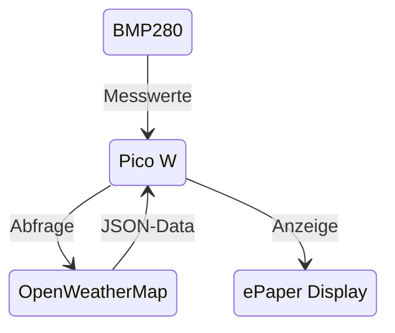

# Skizze: Anzeige von Wetterdaten 
## Ziel
- Abfrage von Wetter/Klimadaten
	-	Aussen: Temperatur, Feuchtigkeit, Wind, Luftdruck von OpenWeatherMap
	-	Innen: Temperatur, Druck, Feuchtigkeit von einem BME280-Sensor
- Aufbereitung auf einem Raspberry Pico W
- Ausgabe auf einem ePaper-Display
- ## Datenfluss

## Vorbereitung
API-Key von OpenWetherMap besorgen: auf https://openweathermap.org/price unter **Free** --> *Get API Key* anmelden. Abfragelimit auf unter 1000 setzen, dann 
fallen keine Kosten an. Im Programm nicht schneller als im Abstand von 90 Sekunden abfragen.

Oder den vorhandenen Key benutzen und nicht häufiger als alle 120 Sekunden abfragen.
## Hardware
### ePaper-Display 
[Anschlussschema für das ePaper-Display gibt es hier: github.com/BBBys/gpio_pinout_diagram_NEU.png](https://github.com/BBBys/BackupServer/blob/main/doc/gpio_pinout_diagram_NEU.png)

Anleitungen und Software vom Hersteller gibt es hier: [github.com/waveshareteam/e-Paper](https://github.com/waveshareteam/e-Paper/tree/master/RaspberryPi_JetsonNano)

[so könnte es aussehen](Bilder/b1.jpg)

### BME280 verbinden
- **VCC** (3.3V) -&gt; VIN des Sensors
- **GND** -&gt; GND des Sensors
- **SDA** (GPIO 2) -&gt; SDA des Sensors
- **SCL** (GPIO 3) -&gt; SCL des Sensors
## Software
- Micro Python
- C#
### Wetter-Vorhersage
Zambretti-Algorithmus: [Quelle 1](https://github.com/sassoftware/iot-zambretti-weather-forcasting.git) und
[Quelle 2](https://integritext.net/DrKFS/zambretti.htm)

## Quellen
* [1 Implementierung auf einem Raspberry Nano](https://github.com/BBBys/THBServer)
* [2 Anschluss ePaper-Display](https://www.az-delivery.de/en/blogs/azdelivery-blog-fur-arduino-und-raspberry-pi/e-paper-display-am-esp32-und-esp8266-teil1)
* [3 Datenabruf und Auswertung](https://microcontrollerslab.com/raspberry-pi-pico-w-openweathermap-api-sensorless-weather-station)
* [4 BME280-Bibliothek](https://learn.microsoft.com/en-us/dotnet/api/iot.device.bmxx80.bme280?view=iot-dotnet-latest)
* [5 BME280-Anschluss](https://learn.microsoft.com/en-us/dotnet/iot/tutorials/temp-sensor)
* [6 Wetterdaten von OpenWeatherMap](https://www.kampis-elektroecke.de/raspberry-pi/raspberry-pi-wetter/)
